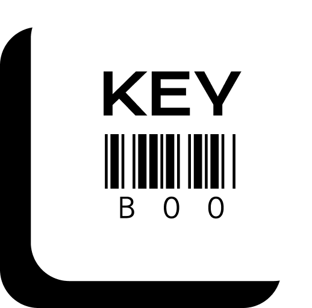

# Key BOO

Welcome to Key BOO, a fun and challenging typing game where you can test and improve your keyboard skills.

## How to Play

1. **Start the Game:**
   - Enter your name to begin.
   - Press any key on the keyboard to start the countdown.

2. **Gameplay:**
   - Type the highlighted letter as quickly as possible.
   - Each correct key press earns you points.
   - The difficulty increases over time, so stay focused!

3. **Game Over:**
   - The game ends when the time runs out or if you make a mistake.
   - The final score, time taken, and keys pressed are displayed.

4. **Play Again:**
   - Click the "Play again" button to start a new game.
   - Challenge yourself to beat your previous score!

## Features

- Responsive design for mobile and desktop.
- Dynamic difficulty scaling based on your performance.
- Countdown before starting the game.
- Background music and game over sound effects.

## Technologies Used

- HTML
- CSS (with animations)
- JavaScript

## Setup and Installation

1. Clone the repository.
2. Open `index.html` in your preferred web browser.

## Author

- [Prasanth](https://github.com/prasanthj2023)(#) 

## Credits

- Background music by [Anirudh Ravichander](https://en.wikipedia.org/wiki/Anirudh_Ravichander)(#)

## License

This project is licensed under the [MIT License](LICENSE).

Enjoy playing Key BOO! 🚀
